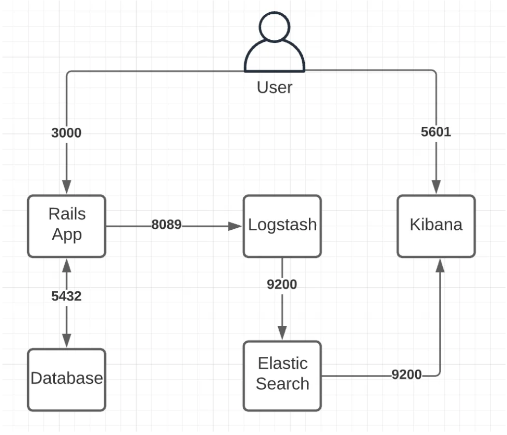

#Project - Configuring Elasticsearch, Kibana and Logstash in a Ruby On Rails application

## Glossary:

- Docker: A containerization platform that allows developers to package applications and their dependencies into isolated containers, ensuring consistency across different environments.
Elasticsearch:

- Elasticsearch: A distributed search and analytics engine designed for scalability and full-text search. Often used for indexing and searching log data.

- Kibana: An open-source data visualization and exploration tool designed for Elasticsearch. It provides a graphical interface for analyzing and interacting with large volumes of data.

- Logstash: An open-source server-side data processing pipeline that ingests, processes, and outputs data. Commonly used for collecting, enriching, and forwarding logs. It will be responsible for proccess the data and send it to ElasticSearch.


# Use case:




## Request on Port 3000:

- The user makes a request to your Ruby on Rails application, which is configured to run on port 3000.

## Logging Generation in the Rails Application:

- The Rails application generates logs related to the request, such as information about the controller, action, parameters, and other relevant details.

## Log Sending to Logstash:

- The logging configuration in the Rails application sends these logs to Logstash, which is configured to listen on port 8089.
## Processing in Logstash:

- Logstash receives the log messages from the Rails application on port 8089.
- If configured, Logstash can apply filters to enrich the logs with additional information, such as geolocation, user identification, among others.

## Forwarding to Elasticsearch:

- After processing, Logstash forwards the enriched logs to Elasticsearch, which is running on port 9200.
- The logs are indexed in Elasticsearch, making them searchable and analyzable.

## Visualization in Kibana:

- Kibana, configured to access the log index generated by Elasticsearch, allows developers and administrators to visualize and analyze logs in a graphical and interactive manner.
In Kibana, they can create specific visualizations to monitor performance, identify errors, and understand application behavior.

## Example Dashboard in Kibana:

- A developer can create a dashboard in Kibana that displays statistics about requests received on port 3000, response times, HTTP status codes, and other relevant metrics.##


# Application setup:

- ```docker-compose build```
- ```docker-compose up```


# How to test it?

Invoke the ```simulate.rake``` file which will run the following rake task:

```ruby

# frozen_string_literal: true

require 'net/http'

namespace :simulate do
  task traffic: :environment do
    routes = Rails.application.routes.routes.map do |route|
      path = route.path.spec.to_s
      path.split('(').first if path.match?(/api/)
    end.compact

    loop do
      url = URI("http://localhost:3000#{routes.sample}")
      puts url
      Net::HTTP.get(url)
    end
  end
end
```

- require 'net/http': Imports the Net::HTTP library for making HTTP requests.

- namespace :simulate: Declares a namespace for the rake task called simulate.

- task traffic: :environment do: Defines a rake task named traffic that depends on the Rails environment being loaded (:environment).

- routes = Rails.application.routes.routes.map do |route| ... end.compact: Retrieves all routes defined in the Rails application and filters out those related to APIs. It creates an array called routes.

- route.path.spec.to_s: Extracts the path specification of each route as a string.

- path.split('(').first if path.match?(/api/): Checks if the path contains 'api' and extracts it. This helps filter out non-API routes.

- compact: Removes any nil values from the array, ensuring that only API routes are included in the routes array.

- url = URI("http://localhost:3000#{routes.sample}"): Selects a random API route from the routes array and constructs a full URL by appending it to "http://localhost:3000". The result is stored in the url variable.

- Net::HTTP.get(url): Performs a simple HTTP GET request to the randomly selected API route. This action triggers the Rails application to generate logs related to the accessed API route.


In summary, this rake task simulates web traffic by making requests to random API routes in a Rails application, generating logs that are processed and stored in the ELK stack. It allows for testing and observation of how the ELK stack handles and visualizes logs during various access scenarios.


The data visualization will be displayed as the Use Case image shows on the 5601 port. (Kibana)

### Disclaimer

The continuous loop in the rake task generates a constant stream of HTTP requests to random API routes of the Rails application. Each request triggers the generation of log entries in the Rails application, and these logs are then forwarded to Logstash for processing.

Logstash processes logs in a pipeline, which includes inputs, filters, and outputs. However, if the rate of incoming logs exceeds the processing capacity of Logstash, the Logstash pipeline can become backlogged. The primary issue is that Logstash has a finite processing capacity, and if it receives logs at a rate faster than it can process, the buffer can fill up


## Results


The images below display a comprehensive overview dashboard in Kibana. It provides a visual representation of the application hits generated by the continuous loop of requests:


## Credit

This implementation is based on a tutorial from nam nguyen 
[Configuring Docker Elasticsearch, Kibana, Logstash to get log Rails](https://medium.com/@nam-nguyen/configuring-docker-elasticsearch-kibana-logstash-to-get-log-rails-98a260350a91). The tutorial provided valuable insights and guidance in configuring the ELK stack for logging in a Ruby on Rails application. I highly recommend checking out the original tutorial for a detailed walkthrough.

